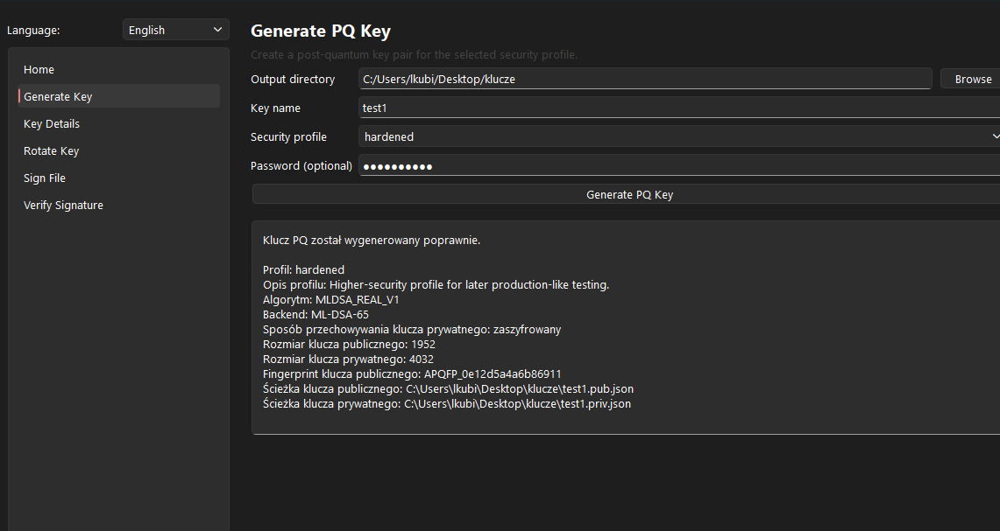
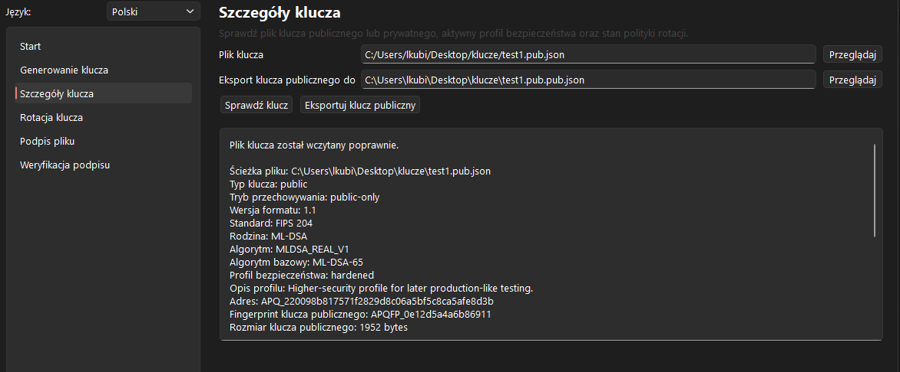
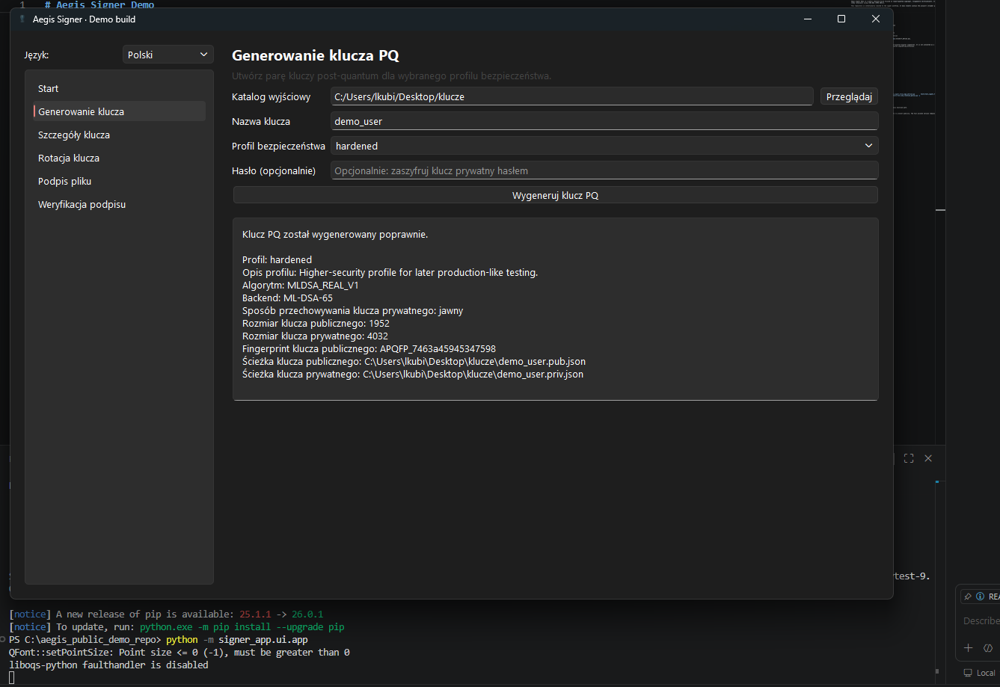
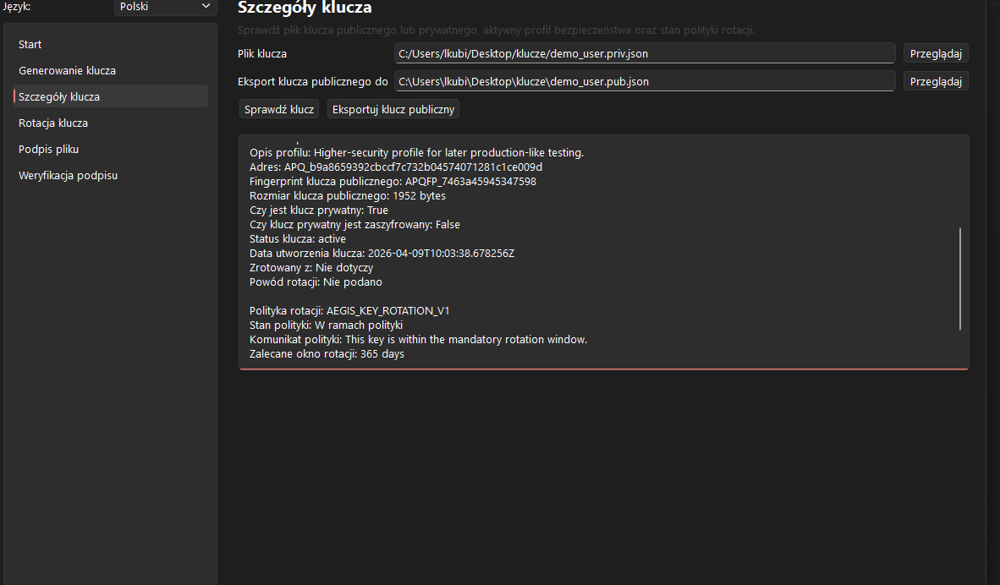

# Aegis Signer Demo

Aegis Signer Demo is a public showcase build focused on **post-quantum digital signatures**, **file verification**, **key inspection**, **private-key protection**, and **key rotation** using **ML-DSA aligned with NIST FIPS 204**.

This repository is intentionally limited to the **signer workflow**. It is meant to demonstrate the current public-facing direction of the project without exposing the broader private engineering scope.

## What this demo is

This demo presents a real signer application with:

- a desktop UI built with **PySide6**
- **ML-DSA** key generation across three profiles
- optional **password-based private-key encryption**
- key inspection with **security metadata and policy state**
- file signing and signature verification
- **key rotation**
- **rotation-policy evaluation and enforcement**
- a focused public test subset for the signer scope

## Security highlights

This public demo explicitly shows that:

- private keys can be stored in **encrypted form** when protected with a password
- encrypted private keys use **Argon2id** for password-based key derivation and **AES-256-GCM** for authenticated encryption
- keys carry **lifecycle and security metadata** such as status, creation time, and rotation information
- the project applies a **rotation policy** rather than treating key generation as a one-time action
- incomplete, rotated, revoked, or overdue keys are not meant to be accepted as normal signing keys

See [SECURITY_NOTICE.md](SECURITY_NOTICE.md) for the public security framing and implementation-level details used in the demo.

## Supported profiles

The current public demo includes three ML-DSA profiles:

- `standard` → `ML-DSA-44`
- `hardened` → `ML-DSA-65`
- `max` → `ML-DSA-87`

The project also exposes metadata such as:

- `key_status`
- `key_created_at_utc`
- `rotated_from`
- `rotation_reason`
- policy states such as `ok`, `due_soon`, `overdue`, `rotated`, `revoked`, or `unknown`

## Rotation policy

The public demo includes a concrete key-rotation model:

- `standard` → recommended rotation window: **365 days**
- `hardened` → recommended rotation window: **365 days**
- `max` → recommended rotation window: **548 days**
- `due_soon` threshold → **30 days**
- signing is only considered acceptable for policy states `ok` and `due_soon`

This is meant to show that key lifecycle and operational policy are part of the product, not an afterthought.

## NIST direction

The current public demo is centered on **FIPS 204 / ML-DSA**.

The broader project direction is to stay **NIST-aligned**, with the signer domain currently anchored on:

- **FIPS 204** for ML-DSA signatures

The private full-version roadmap may later expand into:

- **FIPS 205 / SLH-DSA** as an additional signature track
- **FIPS 203 / ML-KEM** for secure exchange / KEM-oriented workflows

This demo is not a certification claim. It is a public engineering showcase aligned with the current NIST direction chosen for the signer domain.

## What this demo includes

Public scope includes:

- signer UI
- ML-DSA key generation
- optional private-key encryption
- key inspection and public-key export
- file signing
- signature verification
- key rotation
- selected signer-domain tests

See [DEMO_SCOPE.md](DEMO_SCOPE.md) for the exact public boundary.

## What the full private version is expected to add

The private full version is expected to expand beyond this public demo in areas such as:

- broader UI polish and packaging
- wider operational workflows
- larger private API and CLI coverage
- stronger release engineering and distribution paths
- extended security controls and project policies
- possible future expansion toward additional NIST PQ standards

See [FULL_VERSION_OUTLOOK.md](FULL_VERSION_OUTLOOK.md) for the positioning used in public materials.

## Suggested first demo flow

1. Launch the desktop UI.
2. Generate a new key using one of the ML-DSA profiles.
3. Inspect the key details and review the policy state.
4. Sign a file.
5. Verify the signature.
6. Rotate the key and compare the old and new key states.

## Screenshots

### Home — Polish



### Home — English



### Generate key



### Key details



## Quick start

### Recommended environment

Use a **clean virtual environment**.

```powershell
python -m venv .venv
.\.venv\Scripts\Activate.ps1
python -m pip install -U pip
python -m pip install -r requirements-demo.txt
```

### Run the UI

```powershell
python -m signer_app.ui.app
```

### Run the CLI-style demo flow

```powershell
python signer_demo.py
```

### Run the public test subset

```powershell
python -m pytest tests/test_signer_key_service.py tests/test_signer_file_sign_service.py tests/test_signer_file_verify_service.py tests/test_demo_signer_flow_service.py tests/test_key_rotation_policy.py -q
```

## Repository contents

- `signer_app/` — public UI and signer services
- `app/` — minimal shared modules needed for key policy and private-key protection
- `tests/` — public signer-domain tests
- `images/` — screenshots used in the public README
- `signer_demo.py` — simple demo flow script

## Important public note

This repository is a **public demo repository**, not the full private product.

The purpose of this repo is to show the signer workflow, key lifecycle, and NIST-aligned direction clearly and honestly.
